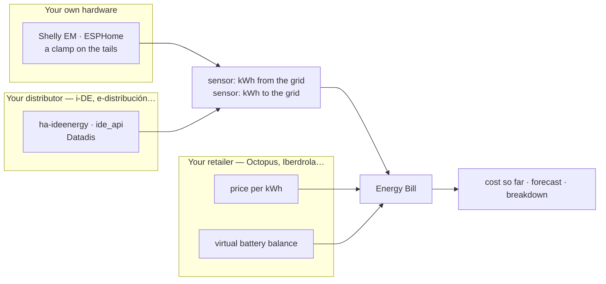

# Energy Bill

[![hacs][hacs-badge]][hacs-url]
[![release][release-badge]][release-url]
[![validate][validate-badge]][validate-url]
[![licence][licence-badge]](LICENSE)

Works out what your Spanish electricity bill is going to say, from the hourly
statistics Home Assistant already keeps. Not an estimate of consumption — the
actual bill, concept by concept: power term, energy by tariff period, surplus,
bono social, meter rental, electricity tax and VAT.

It reproduces three real bills from two different retailers to within a cent.

## Why

Home Assistant's energy dashboard tells you what you consumed and roughly what
it cost. A Spanish bill is a different animal: two power periods charged per
day whether you use them or not, three energy periods, surplus compensation
capped at the energy term, and two taxes applied to bases that **are not the
same from one retailer to the next** — Iberdrola puts the bono social inside
the electricity-tax base, Octopus leaves it out. Same tariff, different total.

So this models a bill as what it is: a list of concepts, each with its own
accrual basis, and taxes that declare which concepts they apply to.

## Features

- **Cost so far this cycle**, with the full breakdown as attributes.
- **Forecast for the cycle**, extrapolating only the part that depends on
  behaviour: the power term and the daily charges are already known.
- **Energy split by tariff period** (P1/P2/P3), including the rule most
  calculations miss — weekends and national holidays are off-peak all day.
- **Hourly net balance**, as Spanish law requires: export three kWh and import
  one in the same hour and you exported two.
- **Prices fixed or from an entity**, the same choice the energy dashboard
  offers. An entity's *hourly statistics* are read, not its current value, so
  an index-linked tariff is billed with the price that applied at the time.
- **Tax-inclusive price entities are handled.** Some publish the price with
  taxes and some without — Octopus does both, one for purchase and one for
  surplus. Tick the box and they are stripped back before the taxes are
  applied again.
- **Virtual batteries.** Surplus that has nothing left to cancel out becomes a
  balance in euros — Solar Wallet at Octopus, Solar Cloud at Iberdrola. Point
  at the entity holding it and it is spent against the finished bill, after
  tax, down to zero and never below.
- **Discounts, monthly fees and a configurable tax base**, because retailers
  differ and a hard-coded formula would be right for exactly one of them.
- **Diagnostics download** that shows where the chain of numbers diverges.

## Installation

### HACS

1. HACS → three-dot menu → **Custom repositories**.
2. Add `https://github.com/domotk/energy-bill` with category **Integration**.
3. Install **Energy Bill** and restart Home Assistant.
4. Settings → Devices & services → **Add integration** → *Energy Bill*.

### Manual

Copy `custom_components/energy_bill` into your `config/custom_components`
folder and restart.

## Setting it up

Five short steps, each asking about one thing.

| Step | What it asks |
|---|---|
| 1. Meters and power | Your grid import meter, the export one if you have panels, the day your cycle starts, and the kW you contract in each power period |
| 2. How your energy is priced | One question, three answers: the same price at every hour, three prices by time of use, or an entity publishes it |
| 3. The prices themselves | Exactly the fields that answer implies, and nothing else |
| 4. What comes back | Surplus price, the virtual battery holding your balance, and whether surplus is capped at the energy term |
| 5. Fixed costs and taxes | Bono social, meter rental, monthly fees, and the tax rates — filled in with the Spanish ones |

Step 2 is what makes the rest short. A tariff either has one price, or a table
of three, or none at all because it changes hourly — and knowing which means
step 3 can ask for three fields instead of showing eight and hoping you know
which ones are yours. **Time-of-use prices are asked for together**, because
that is how they appear on the contract and a price you cannot see next to its
neighbours is a price you cannot check.

> **Copy the prices from your contract, not from the printed bill.** Bills round
> prices to three decimals, and computing with `0,095` instead of `0,09537` is
> about half a per cent out over a month.

The consumption sensor needs **long-term statistics** — that is, a
`state_class` of `total` or `total_increasing`. Without them there is nothing
to build a bill from, and the integration says so rather than reporting €0.00.

## Where the readings can come from

This integration deliberately measures nothing itself. It reads entities that
already exist, whatever produced them:



**Your own meter** is the most responsive and the one you already trust: it
updates every few seconds and owes nothing to anybody's servers. It can also
disagree with the distributor's official register by a percent or so, which is
the difference between what you measure and what you are billed for.

**Your distributor's official readings** are the ones the bill is actually made
of. For i-DE — the distributor across much of Spain — two integrations exist,
and they answer different questions:

| | [`ldotlopez/ha-ideenergy`](https://github.com/ldotlopez/ha-ideenergy) | [`ad-ha/ide_api`](https://github.com/ad-ha/ide_api) |
|---|---|---|
| What it gets | The official hourly history, and backfills it into long-term statistics | The meter read on demand, within about two minutes |
| Lag | 24-48 h, which is when i-DE publishes | Live |
| Good for | **This integration**: a bill computed from the same figures it will be billed from | Watching what the house is doing right now |

Either needs the *Usuario Avanzado* profile on the i-DE website, which is free
and takes a day or two to be granted. [Datadis](https://datadis.es) is the
official route covering every Spanish distributor, if yours is not i-DE.

The point of the backfilling one is worth spelling out: it writes history, so
installing it today gives this integration months of past cycles to rebuild,
not just the ones from here on.

**Your retailer** supplies the two things no meter can know: what a kWh cost at
each hour, and what your virtual battery holds. Both go in as entities.

## Entities

| Entity | What it is |
|---|---|
| `sensor.<name>_cost_this_cycle` | Cost so far. The breakdown is in its attributes |
| `sensor.<name>_forecast_for_this_cycle` | What the whole cycle is heading for |
| `sensor.<name>_energy_taken_from_the_grid` | kWh imported this cycle |
| `sensor.<name>_energy_exported_to_the_grid` | kWh exported this cycle |

The breakdown rides as attributes rather than one entity per concept: the list
of concepts is open-ended — a retailer can invent a fee tomorrow — and one
entity per line would reshape the entity registry every time somebody edits
their tariff.

## How the bill is built

```
energy    = Σ  kWh(hour) × price(hour)        netted within each hour
surplus   = −Σ kWh exported × surplus price   capped at the energy term
power     = Σ  kW × €/kW/day × days           per power period
fixed     = daily and monthly charges
discounts = % of the undiscounted base, stacked
tax       = % of whichever concepts that tax declares
balance   = the virtual battery, spent after tax, never past zero
```

Everything is kept at full precision and rounded once, for display. Expect the
total to land within a cent or two of paper: no single rounding order
reproduces every retailer, and modelling each one's from a handful of bills
would be overfitting rather than accuracy.

## Contributing

The engine is deliberately free of Home Assistant imports, so
`python tests/test_engine.py` runs anywhere and checks it against three real
bills. If you have a bill this gets wrong, that test is where it should go —
an anonymised set of figures is all it takes.

## Built with

No dependencies beyond Home Assistant. Every push is checked by the
[HACS action](https://github.com/hacs/action), by
[hassfest](https://developers.home-assistant.io/blog/2020/04/16/hassfest), and
by the engine's own test.

## Licence

MIT © Rubén Brieva

[hacs-badge]: https://img.shields.io/badge/HACS-Custom-41BDF5.svg
[hacs-url]: https://github.com/hacs/integration
[release-badge]: https://img.shields.io/github/v/release/domotk/energy-bill
[release-url]: https://github.com/domotk/energy-bill/releases
[validate-badge]: https://github.com/domotk/energy-bill/actions/workflows/validate.yml/badge.svg
[validate-url]: https://github.com/domotk/energy-bill/actions/workflows/validate.yml
[licence-badge]: https://img.shields.io/github/license/domotk/energy-bill
